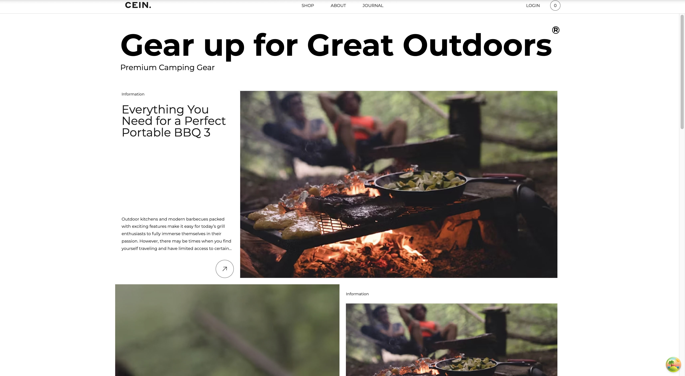
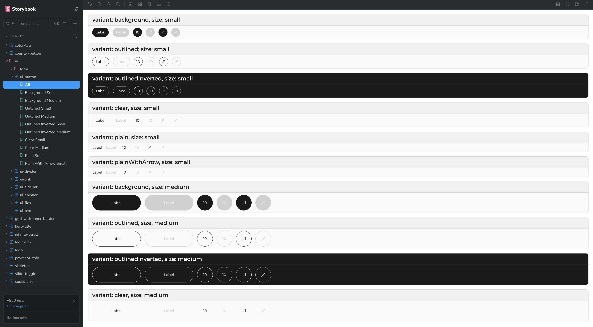

<h1 align="center"> 🏕️ Camping Gear E-Commerce built with React and Node</h1>

<h3 align="center">
  <a href="https://github.com/TokarenkoKate/Camping-Gear-E-Commerce">View client</a> |
  <a href="https://github.com/TokarenkoKate/camping_ecommerce_nestjs">View API</a>
</h3>

## What is this and who is it for

This is a showcase product I've built in my spare time. A modern, modular, and responsive e-commerce web application tailored for camping enthusiasts. This project leverages cutting-edge frontend technologies and architectural best practices to deliver a seamless shopping experience.

## 🚀 Tech Stack

- **React 18** – Modern, concurrent-ready frontend framework.
- **Redux** – Predictable state container for managing the shopping cart.
- **React Router v6** – Utilizes `data` APIs (`loaders` and `actions`) for efficient route-based data fetching.
- **Webpack 5** – Custom configurations for both development and production environments, with shared common settings.
- **TypeScript** – Ensures type safety and improved developer experience.
- **SCSS / CSS Modules** – Modular and maintainable styling approach.
- **Storybook** – Isolated development and documentation of UI components.
- **Feature-Sliced Design (FSD)** – Scalable architectural methodology for frontend applications.

## ✨ Features and interesting things implemented

- **Feature-Sliced Design Architecture**

This project is built using the [**Feature-Sliced Design (FSD)**](https://feature-sliced.github.io/documentation/) architectural methodology to achieve loose coupling and high cohesion across the codebase.

One of the coolest features of FSD is its top-down dependency flow:

**shared** → **entities** → **features** → **widgets** → **pages** → **app**

The key thing of FSD methodology is its **modularity**, For instance, everything inside **shared slice** - such as UI components, custom hooks, and utility functions-is completely decoupled from business logic. This means shared modules can be effortlessly migrated to other projects without any modifications.

**Entity slice**
represents concepts from the real world, it usually corresponds to database tables, like _User_ entity, _Order_, _Product_, _Category_, etc.

In my case, I implemented an _Article entity_. Within its `model/` folder, I defined the TypeScript interfaces and API requests. The `ui/` folder contains reusable components like the _ArticleCard_, which can be used across various parts of the app-for example, in a "Most Recent Articles" section on the Main page or a list of articles on the Journal page.

**Features layer** contains functionality that carries business value. For instance, I implemented the authentication logic here, including the _AuthForm_ component and corresponding API calls. These features are then reused in multiple places, such as the _Login_ and _Sign Up_ pages, without duplicating logic.

**Widgets** are higher-level UI constructs that bring together multiple features into cohesive, reusable blocks. For example, I created a _Navbar_ widget, which integrates the _Cart button_, _Navigation menu_, and _Authentication button_. Each of these is a separate feature but is composed together into a single UI unit.

**Pages** represent individual screens of the application. Each page is composed of various slices-entities, features, widgets, and shared components-much like puzzle pieces coming together to form a complete user experience. This layering makes it easier to develop, test, and scale pages independently.

- **Advanced Webpack Configuration**.

This project is built using the Webpack bundler. I implemented key Webpack features inspired by the excellent book [**SurviveJS - Webpack book**](https://survivejs.com/books/webpack/), authored by the developers of `webpack-merge`.

**Modular Config Structure**. One of the first concepts I adopted was separating development and production configurations while reusing shared settings between them. By composing configurations with webpack-merge, I gained precise control over how different config parts are combined. This modular approach helps ensure things like loader order are handled correctly, which is crucial—for example, when combining style-loader, css-loader, and postcss-loader.

**CSS Handling**.
I enhanced CSS handling using a combination of loaders and plugins. In the common config, I used css-loader, postcss-loader, and sass-loader to process styles.
In production, I implemented MiniCssExtractPlugin to extract CSS into separate files, allowing the browser to load CSS and JS in parallel. In development, I used style-loader to inject styles directly into the DOM, implementing HMR.

**Babel Integration**.
For JavaScript and TypeScript transformation, I used Babel to handle modern syntax and JSX.
I made special attention to proper presets and plugins options, for example, for @babel/preset-env we need to set modules: false, otherwise webpack will not be able to implement tree-shaking. I also included @babel/plugin-transform-runtime to load polyfills only when necessary, reducing bundle size. For TypeScript type checking, I used the fork-ts-checker-webpack-plugin to run type checking in a separate process. It gives a nice performance boost to workflow.

**Production Optimizations**.
In the production configuration, I focused on performance and caching.
I split third-party libraries from node_modules into a separate vendor chunk using splitChunks. This enables the browser to cache vendor code independently of the app code, so users don’t have to re-download it unless it actually changes.

**Minification & Compression**.
To reduce the final bundle size and enhance performance, I added multiple minimizers: terserPluginMinimizer: Minifies JavaScript, removes dead code, and compresses variable names. cssMinimizerPlugin: Optimizes and compresses CSS files. imageMinimizer: Compresses image assets (e.g., JPEG, PNG) without visible quality loss.

- **Smart Routing**

In this app I used React Router v6, that has some peculiar features different from previous versions. For example, **createBrowserRouter API** enables new data APIs like **loaders** and **actions**. Loaders turned out to be such a nice feature that provides data to the route element **before** it renders. We need to set up loader API requests, and inside of route we can manipulate this data. In my app, I used it on app starting route and while the data is loaded in the background I show some nice animation with loading screen.
Though, for now I have not found a way how to fix Core Web Vitals issues, for example, issues with Cumulative Layout Shift.

- **Lazy Loading and Code Splitting**

To optimize performance, I implemented code splitting using the built-in React.lazy() function along with Suspense. This approach ensures that pages are loaded only when the user navigates to them, reducing the size of the initial JavaScript bundle. These components are excluded from the main bundle and are instead loaded on demand.

Lazy loading is also applied to API requests for UI sections that are not initially visible. For instance, on the product details page, a list of similar products appears at the bottom. This list is fetched only when the user scrolls to that section, using the Intersection Observer API.

Another performance optimization is infinite list loading. When users first access a list of products or articles, only the items currently in view are loaded. As the user scrolls to the bottom of the list, additional items are fetched dynamically.

- **Design system**.

I implemented solid system of CSS globals, that includes typography, colors, spacing, shadows system. I thoroughly analyzed the given design to find the colors, spacing, typography patterns.

I created the CSS variables starting from the smallest text like
--fs-100 to the largest ones --fs-1000, for small sizes, for larger sizes I used fluid typography for smooth scaling between the minimum and maximum value depending on the viewport width. Then assigned those sizes for the specific typography variants like 'heading-md', 'body-xs'.

- **Storybook Integration**

For reusable shared components I implemented Storybook. It works as a documentation of reusable isolated components. The Stories give a clear understanding how each component looks like, what props them access and how they behave in different states, like disabled, hovered, active.

## Scripts

| Command             | Description                         |
| ------------------- | ----------------------------------- |
| `npm run start`     | Run the development server          |
| `npm run build`     | Bundle the app for production       |
| `npm run storybook` | Launch Storybook for UI development |

👩‍💻 Author
Built with ❤️ by Kate Tokarenko
